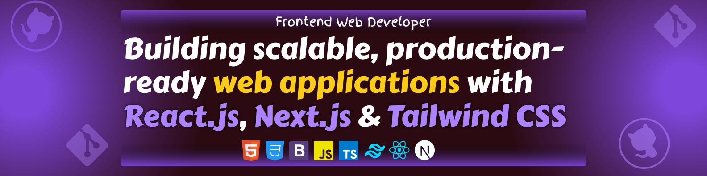

<h1 align="center">Hi 👋, I'm Muhammad Bilal</h1>

  

<h3 align="center">Freelance Web Developer | Crafting Professional Websites to Enhance Your Online Presence | MERN Stack & Full Stack Expert</h3>

- 🌱 I’m currently learning **MERN Stack**

- 👨‍💻 All of my projects are available at [https://israrahmadtech.vercel.app](israrahmadtech.vercel.app)

- 📫 How to reach me **israrahmadtech@gmail.com**

- ⚡ Fun fact **I like to help others**

<h3 align="left">Skills</h3>

React.js • Next.js • JavaScript • TypeScript • Tailwind CSS • Supabase • HTML • CSS • Git • Bootstrap

<h3 align="left">Connect with me</h3>

  

  

  

<h3 align="left">Languages</h3>

<table>
  <tr>
    <td align="center">
       HTML5</td>
    <td align="center">
       CSS3</td>
    <td align="center">
       JavaScript</td>
    <td align="center">
       TypeScript</td>
  </tr>
</table>

<h3 align="left">Tools</h3>

<table>
  <tr>
    <td align="center">
      
       React.js
    </td>
    <td align="center">
      
       Next.js
    </td>
    <td align="center">
      
       Tailwind CSS
    </td>
    <td align="center">
      
       Bootstrap
    </td>
    <td align="center">
      
       Supabase
    </td>
  </tr>
