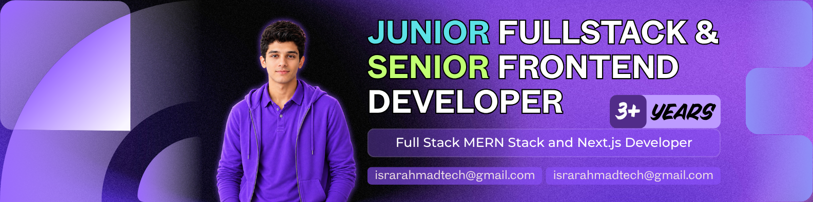

<div align="center">



<br/>


<p>
  <a href="https://www.linkedin.com/in/israr-ahmad-tech"></a>
  <a href="mailto:israrahmadtech@gmail.com"></a>
  <a href="https://israrahmadtech.vercel.app"></a>
  <a href="https://github.com/israrahmadtech"></a>
</p>


</div>

<br/>

## 🚀 About Me

```ts
const israrAhmad = {
  role: "Senior Frontend Developer @ Apptex Software Solutions",
  location: "Peshawar, Pakistan",
  stack: ["React.js", "Next.js", "TypeScript", "Tailwind CSS", "Redux Toolkit", "GSAP"],
  learning: ["Node.js", "Express.js", "MongoDB", "Redis", "Socket.io"],
  currentGoal: "Becoming a well-rounded Full Stack MERN Engineer",
  funFact: "Ships polished UIs, then goes hunting for backend depth",
};
```

- 🔭 Building production frontends — admin dashboards, SaaS panels, and business/agency sites
- 🌱 Leveling up backend engineering — APIs, auth flows, real-time features with sockets
- 🎓 Certified Web Developer (SMIT Peshawar) | BS Software Engineering @ Virtual University
- ⚡ Research-driven dev — uses AI-assisted tools (Antigravity) to move fast without cutting corners
- 💬 Ask me about React, Next.js, Tailwind, GSAP animations, and Supabase

<br/>

## 🛠️ Tech Stack

<div align="center">

**Frontend**


**Backend & Realtime**


**Database, BaaS & Tools**


</div>

<br/>

## 🎯 Current Focus

| Frontend Depth | Backend Growth | Practice |
|---|---|---|
| Modular architecture, GSAP-driven UI, Shadcn UI | Auth flows, REST APIs, Redis, Socket.io | Daily DSA problem-solving |

<br/>

## 💼 What I Build

<table>
<tr>
<td width="50%">

**Products**
- Admin dashboards with modular architecture
- Full stack MERN applications
- Auth & role-based access systems
- Real-time features with Socket.io

</td>
<td width="50%">

**Approach**
- Clean, readable, minimal code
- Reusable components over duplication
- Service-layer separation (APIs / Firebase)
- Custom hooks for scalable data fetching

</td>
</tr>
</table>

<br/>

## 📊 GitHub Stats

<div align="center">


</div>

<br/>

## 🤝 Connect With Me

<div align="center">
  <a href="https://www.linkedin.com/in/israr-ahmad-tech"></a>
  <a href="https://github.com/israrahmadtech"></a>
  <a href="mailto:israrahmadtech@gmail.com"></a>
</div>

<br/>

<div align="center">
<i>Building practical web products with a strong frontend foundation — while strengthening APIs, databases, and system design to become a high-value full stack MERN developer.</i>
</div>
